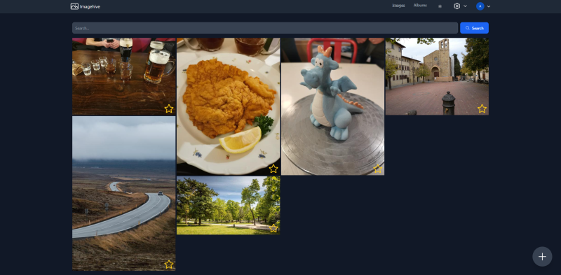

https://github.com/GyrosOfWar/imagehive

## Targeted features
- Powerful user management (photos are by default private, can be shared with other users in the app, or users outside it)
- A photo feed similar to GPhotos or Apple Photos, searchable.
- Album management: Allow creating albums with images and share them with others
- Automatic tagging of images
- Easy deployment with a `docker-compose.yaml` file. (potentially also provide a Kubernetes deployment setup)

## Non-features
- Support for databases other than PostgreSQL. We use PostgreSQL specific features and support for MySQL etc. is not planned.
- Image editing support. We want to keep the scope reasonable (this is a side project).

